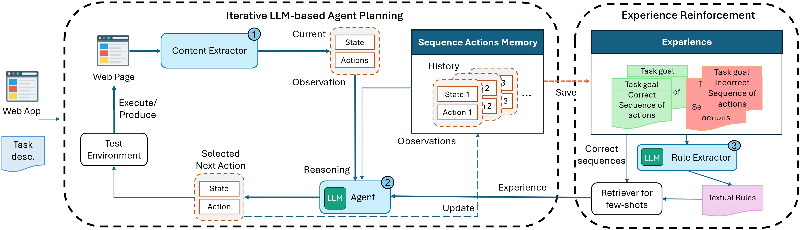

# Toward Generation of Web Test Cases from Task Descriptions via Iterative Agent Planning

<p align="center">
<a href="https://miniwob.farama.org/"></a>
<a href="https://www.python.org/downloads/release/python-3115/"></a>
<a href="https://www.selenium.dev/blog/2024/selenium-4-18-released"></a>
<a href="https://googlechromelabs.github.io/chrome-for-testing/"></a>
</p>


This repo holds the code, dataset and instructions for the paper __Toward Generation of Web Test Cases from Task Descriptions via Iterative Agent Planning__ @ASE 2025.

## HxAgent
HxAgent is an iterative LLM-based agent planning approach for web automation that determines the next action based on observations of current content, short-term memory of previous states and actions, and long-term experience with (in)correct sequences.




## Table of Contents

* [Getting Started](#getting-started)
  - [Requirements](#requirements)
  - [Setup](#setup)
  - [Dataset](#dataset)
    - [MiniWoB++](#miniwob)
    - [Real world application](#real-world-application)
  - [Usage Guide](#usage-guide)
* [Disclaimer](#disclaimer)

## Getting Started
This section describes the requirements, and contains instructions, to set up and running the project.

### Requirements

[Python 3.11.5](https://www.python.org/downloads/release/python-3115/)

[Pip 24.0](https://www.python.org/downloads/release/python-3115/)

[Chrome 131.0.6778.69](https://googlechromelabs.github.io/chrome-for-testing/)

[Chromedriver 131.0.6778.69](https://googlechromelabs.github.io/chrome-for-testing/)

For the Chrome browser, you need to set up the Chrome for Testing browser with the same version as Chromedriver. You can follow these instructions:
1) Install Chrome 131.0.6778.69 (see [this instruction](https://developer.chrome.com/blog/chrome-for-testing/) to install it either via command prompt or by downloading it from the web).
2) Go to  `.env` and add the following parameter:
```
CHROME_TESTING_PATH = <the_path_to_your_chrome_for_testing>
```

For the Chromedriver version, you should install the one that match the Chrome version.

Installing chromedriver can be tricky depending on your operating system. Some operating systems can automatically detect the chromedrive when placed in your `PATH` (on Windows) or `/user/local/bin` (on MacOS). Otherwise, you can follows these instructions:
1) Download and extract the appropriate version of Chromedriver from the embedded link above.
2) Go to  `./core/simulator.py` and edit line `18` from
```
super().__init__(options=chrome_options)
```
to
```
super().__init__(options=chrome_options, executable_path=<the_path_to_your_chromedriver>)
```
### Setup

To get started:

1. Install the module dependencies into your environment.
```bash
pip install -r requirements.txt
```

2. Set `OPENAI_API_KEY` environment variable to your OpenAI API key by creating an `.env` file in the root directory with the following content.
```
OPENAI_API_KEY=<your key>
```
Your OpenAI API key is available at [OpenAI account page](https://platform.openai.com/account/api-keys). 

3. Prepare the Miniwob Dataset.
```bash
python prepare.py
```

4. To run the real-world tasks that requiring log in as precondition (eg. creat post). You can log in manually from our console log, or set `CHROME_USER_DATA_DIR` environment variable in an `.env` file for auto detect your browser.
```
CHROME_USER_DATA_DIR=<your data dir>
```

### Dataset
#### MiniwoB++
The Miniwob dataset can be found under `vendor/miniwob.tar.gz`, you can run the following script to automatically extract the dataset to the `./dataset` directory.
```
python prepare.py
```
#### Real world application
The real world application dataset can be found under `vendor/real_world_application.json`. You can reference the schema below when using the dataset:

| key           | type  | description                                                                |
|---------------|-------|----------------------------------------------------------------------------|
| task_id       | str   | the id of the task                                                         |
| website       | str   | the name of the website (eg. Youtube, Stackoverflow)
| website_url       | str   | the url of the website (eg. https://youtube.com)                       |
| task_template | str   | the template for the task (eg. "Search {} and click on the {} result")     |
| arg_1         | [str] | an array of possible value for the first arugment in the template          |
| arg_2         | [str] | (optional) some task template require two argument, this is the second one |

In our experiment, we use `popularsite` module in `./dataset/popularsite` to create the task instance from task template with specific popularized argument.

### Usage Guide

To run the main program, type the following into your terminal:
```
python main.py
```

There are several arguments for you to configure as follows:
| argument             | type | description                                                                                                                                                       |
|----------------------|------|-------------------------------------------------------------------------------------------------------------------------------------------------------------------|
| `-d, --dataset`        | str  | the dataset to run on: "real_world_application" (default) and "miniwob"                                                                                           |
| `-m, --mode`        | int  | 1 for main architecture run (default); 2,3,4 for ablation experiments reported in the thesis, namely no_interative_planning, no_short_term_no_experience, and no_experience; 5 for li et al's simulation |
| `-p, --play_back`      | bool | playback mode after sequence generation (default to False) 
| `-E, --eval_only`      | bool | skip training phase (default to False)                                                                                                                                               |
| `-t, --train_instance` | int  | number of instances to train per task (default to 25)                                                                                                             |
| `-e, --eval_instance`  | int  | number of instances to evalutate per task (default to 25)                                                                                                         |
| `-i, --task_id`        | str  | id of the task to run experiment on (default to run all)                                                                                                       |                                                    
| `-r, --randomized`     | bool | setting this might cause unfair evaluation across ablation experiment as evaluation task would be randomized (default to False)                                                       |

<!-- | `-T, --T`        | str  | parameter T (trials) for Li et el's simulation (optional)   -->

The logs will be sent to `./log/<session_mode>`. You can find some examples of our `log` in `./log/` folder.

The optimal experience of a task after training phase will be sent to `./storage/<task_id>.txt`. You can find some examples of our `experience` in `./storage/` folder.

For example, to run on the [Miniwob dataset](https://miniwob.farama.org/) in the mode without iterative planning:
```
python main.py --dataset=miniwob --mode=2
```

To find `task_id` you can reference `tasks.yaml` file.

Here's an replicated command to run for each research questions:

| Experiment                                        | Table Number | Run Command(s)                                                        |
| ---                                               | :----:           | :---:                                                                 |
| **(RQ1)** Effectiveness on sequences of actions generation (Realworld) | III       | ```python main.py --dataset=real_world_application --eval_instance=10```   |
| **(RQ1)** Effectiveness on sequences of actions generation (Realworld) of *Li et al.* | III       | Running the code inside ```zero_shot_structured_reflection_fork_debug``` folder   |
| **(RQ1)** Effectiveness on sequences of actions generation (MiniWoB++) | V       |  ```python main.py --dataset=miniwob```  |
| **(RQ1)** Effectiveness on sequences of actions generation (MiniWoB++) of *Li et al.* | VI       | Running the code inside ```zero_shot_structured_reflection_fork_debug``` folder  |
| **(RQ2)** Experience Analysis | -       | ```python main.py --dataset=miniwob```, if you already ran this, navigate to `./log/session/<task_id>_training.xlsx` for the results.   |
| **(RQ3)** Ablation Study | VII       | ```python main.py --dataset=miniwob --mode=2``` (change `--mode` to *3*, *4* for the remaining ablation)   |
| **(RQ4)** Cost Analysis |        | Running ```results_analysis.ipynb``` to evaluate   |
| **(RQ5)**  Test Case Generation |       | Running ```test_scripts_evaluation.ipynb``` to evaluate   |
|                                                   |         |

## Disclaimer
The code was released solely for research purposes, with the goal of making the web more accessible via language technologies. 
The authors are strongly against any potentially harmful use of the data or technology by any party.